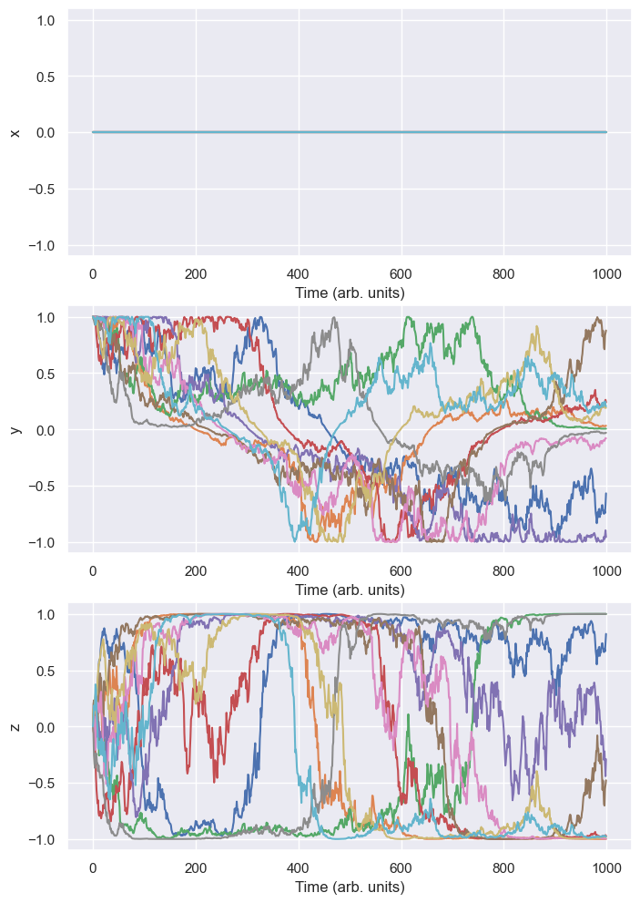

# Stochastic quantum trajectories in cavity QED

This repository contains methods for simulation stochastic quantum trajectories for a qubit in a cavity undergoing dispersive measurement.

## Weak measurement

Weak measurements are implemented by coupling the system to a measurement apparatus or meter $|\Phi\rangle$, then performing a projective measurement on the meter. If the meter is initially in a Gaussian state 

$$\langle r | \Phi\rangle = \exp{\left[-\frac{r^2 dt}{4\tau}\right]}$$,

then dispersive measurement can be modeled as a unitary operation that shifts the measurement readout $r$ depending on the state of the qubit,

$$\langle q | \Phi\rangle = \exp{\left[-\frac{(r-\sigma_z)^2 dt}{4\tau}\right]}$$.

The width of the Gaussian is given by the ratio between $dt$, the time over which the system and meter are allowed to interact, and the characteristic measurement time $\tau$, which is determined by the strength of the interaction. If $dt\ll \tau$, then there is significant overlap between the two outcomes, and the measurement is considered weak.

We can write a POVM for this measurement,

$$M_r=\left(\frac{dt}{2\pi\tau}\right)^{\frac{1}{4}}\exp{\left[-\frac{(r-\sigma_z)^2 dt}{4\tau}\right]}$$,

which can be used to derive the probability of obtaining a certain readout given a qubit's density matrix,

$$P(r|\rho)=\text{Tr}(M_rM^\dagger_r\rho)=\left(\frac{1+z}{2}\right)\exp{\left[\frac{(r-1)^2 dt}{2\tau}\right]} + \left(\frac{1-z}{2}\right)\exp{\left[\frac{(r+1)^2 dt}{2\tau}\right]}$$.

When a readout $r$ is obtained from this distribution, the density matrix is updated according to Bayes' theorem,

$$\rho\rightarrow\frac{M_r\rho M^\dagger_r}{\text{Tr}(M_r\rho M^\dagger_r)}$$.

A stochastic quantum trajectory is obtained by repeating this process many times.

## Simulating stochastic trajectories

This simualtor can be used to generate stochastic trajectories for a qubit undergoing an additional drive.

First, create a qubit in a state given by a Bloch vector $(x,y,z)$, then create the measurements and controls to be applied. Right now there is one of each implemented: `WeakMeasurement` and `RabiDrive`. A weak measurement can be applied with any strength `tau`, any measurement efficiency `eta`, any measurement direction (unlike in the description above, where I focused on a $z$ measurement). Here's an example where a qubit initially in a $y$ eigenstate is subjected to a weak measurement of its $z$ coordinate while we also apply a Rabi drive that rotates the qubit around the $x$ axis.

```
qubit = Qubit([0,1,0])
weak_z = WeakMeasurement(direction = [0,0,1], tau = 100, efficiency = 1)
rabi_x = RabiDrive(direction = [1,0,0], angle = np.pi, time_start = 0, time_end = 1000, pulse_type = "sine squared")

qubit.set_measurements([weak_z])
qubit.set_controls([rabi_x])
fig = qubit.plot_trajectories(n_trajectories = 10, time_start = 0, time_end = 1000, dt = 1, stochastic = True)
```

This results in the following plots, which also show the theoretical ensemble average:

